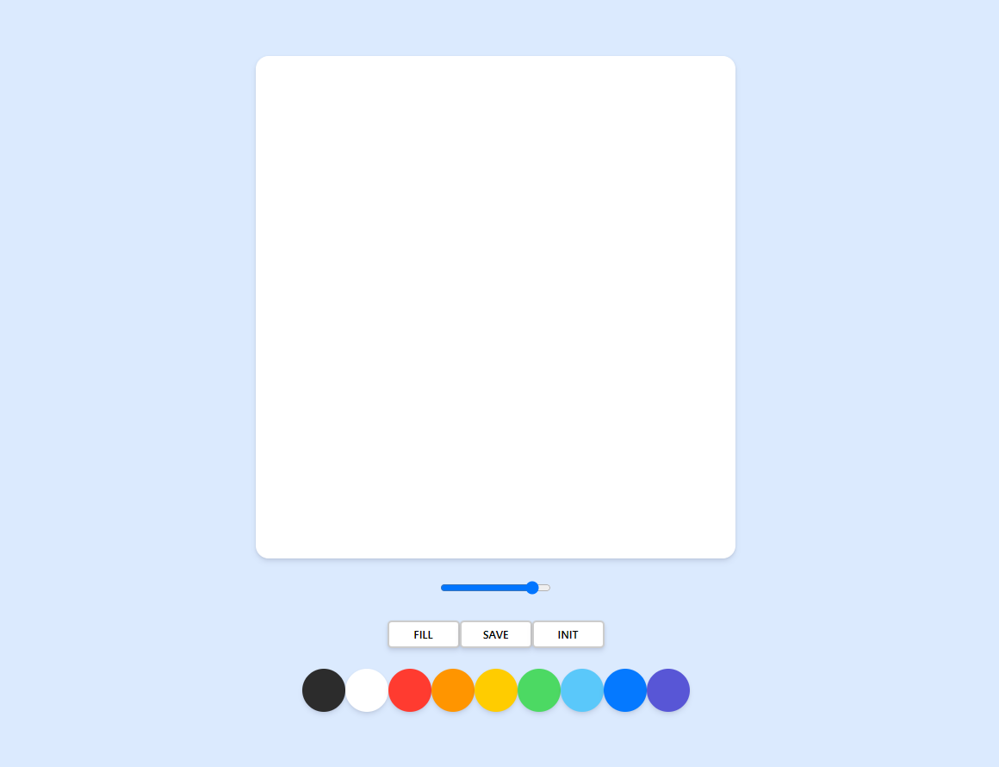
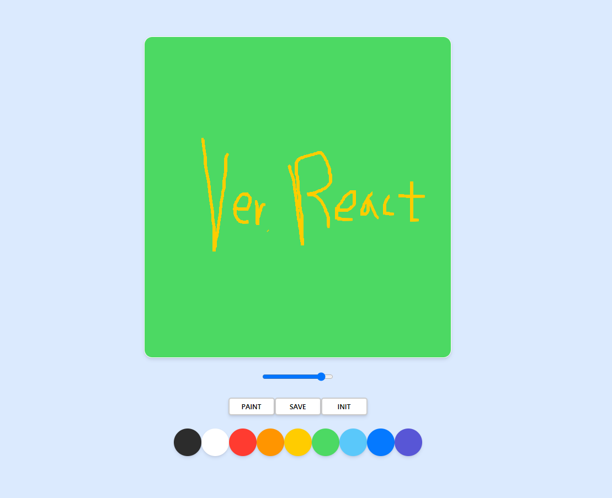

# 🎨 paintJS (ver. React)

[바닐라 JS 버전](https://github.com/souvenir718/paintjs)

## 💻 실행화면

### 🎈 기본 화면

### 🎈 그리기

## 🎯 프로젝트 소개

**"paintJS는 웹 상에서 그림판을 이용할 수 있습니다!"**

기존 `Vanilla JS`를 사용하여 구현한 그림판 기능을 React 환경에서 구현하였습니다.

`canvas` 태그를 이용하였고 반응형 UI를 적용하고자 `tailwindCSS`를 처음 사용해봤습니다. 

아직 사용에 익숙치 않아서 잘 활용을 못했지만 반응형 UI를 사용하는데는 효과적인 것 같습니다.